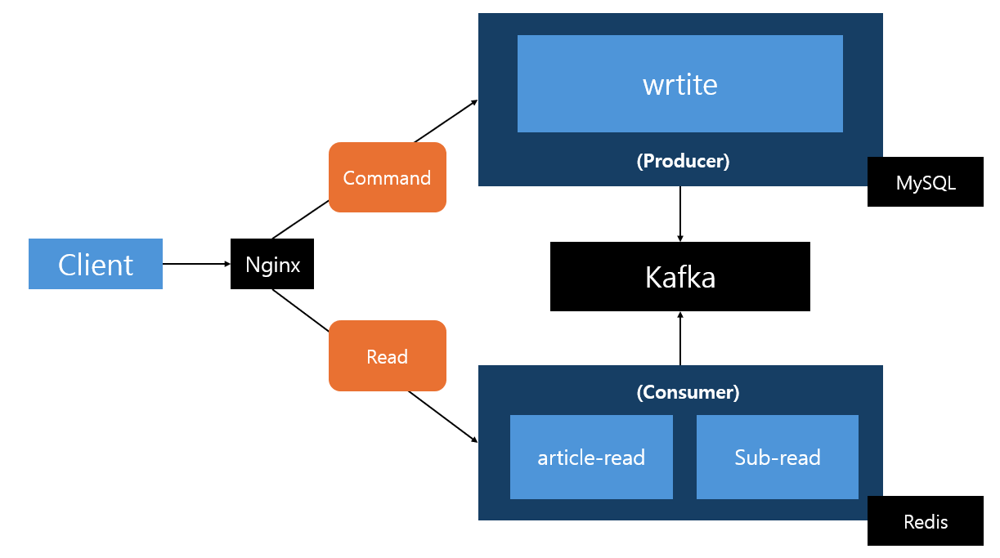

# 프로젝트 개요
서비스가 성장해나가면서 겪게 되는 문제들을 경험하고 싶어 시작한 전형적인 게시판 프로젝트입니다. 실제 게시판과 유사한 형태로 행동하는 가상 유저를 늘려가며, 성능을 측정하고 문제를 발견하면 해결해나가는 형태로 진행 중입니다. 필요에 따라 서비스를 분리하거나 서버를 스케일 아웃하는 등 아키텍처도 지속적으로 변경되고 있습니다.

 

# 주요 기능
백엔드 학습이 목표이므로 화면 개발은 과감히 배제하였으며, 로그인 기능도 배제하여 아래 핵심 기능만 개발 진행하였습니다.
- 게시글 CRUD
- 댓글 CRUD
- 좋아요
- 조회수
- 인기글

 

# 시스템 아키텍처

초기에는 단일 서버 모놀리틱 아키텍처로 출발했으며, 문제 해결 과정을 거쳐 아래 형태로 변화하여 크게 write 서비스, article-read 서비스, sub-read 서비스로 분리되어 있습니다. 비용 문제로 인해 호스트 1대의 자원을 Docker 컨테이너 단위로 분할하여 진행하고 있으며, 서버 1대의 최대 가용 자원은 CPU: 1.0(호스트의 1코어), 메모리: 512MB로 제한하는 규칙을 기준으로 잡았습니다.

- **write 서비스**: 서비스의 모든 쓰기 기능을 담당하며, 조회수 데이터의 백업 처리도 수행합니다.
- **article-read 서비스** : 게시글 읽기 기능만을 담당합니다.
- **sub-read 서비스** : 보조 읽기 서비스 (게시글 읽기 외 읽기 기능들)
- **Nginx**: path 기반 3-way 라우팅 (write / article-read / sub-read)
- **Kafka**: 쓰기 서비스와 읽기 서비스들 사이의 이벤트 브로커로 활용하였습니다

 

# 경험한 주요 이슈사항

상세한 내용은 포트폴리오에서 확인할 수 있으며, 각 섹션을 클릭하면 포트폴리오 페이지로 이동됩니다.

- [데이터 저장소의 구성을 어떻게 할 것인가](https://mirea70.github.io/Portfolio/?section=trouble-1#toy)
- [서버 자원의 한계 봉착](https://mirea70.github.io/Portfolio/?section=trouble-2#toy)
- [읽기 서비스 담당 서버의 자원 한계 봉착](https://mirea70.github.io/Portfolio/?section=trouble-3#toy)
- [페이지네이션의 효율적인 처리 문제](https://mirea70.github.io/Portfolio/?section=trouble-4#toy)
- [조회수 어뷰징에 대한 방지 처리 문제](https://mirea70.github.io/Portfolio/?section=trouble-5#toy)
- [이벤트 발행의 유실 방지에 대한 처리를 어떻게 할 것인가](https://mirea70.github.io/Portfolio/?section=trouble-6#toy)
- [캐시 만료 타이밍에 대한 동시성 이슈](https://mirea70.github.io/Portfolio/?section=trouble-7#toy)
