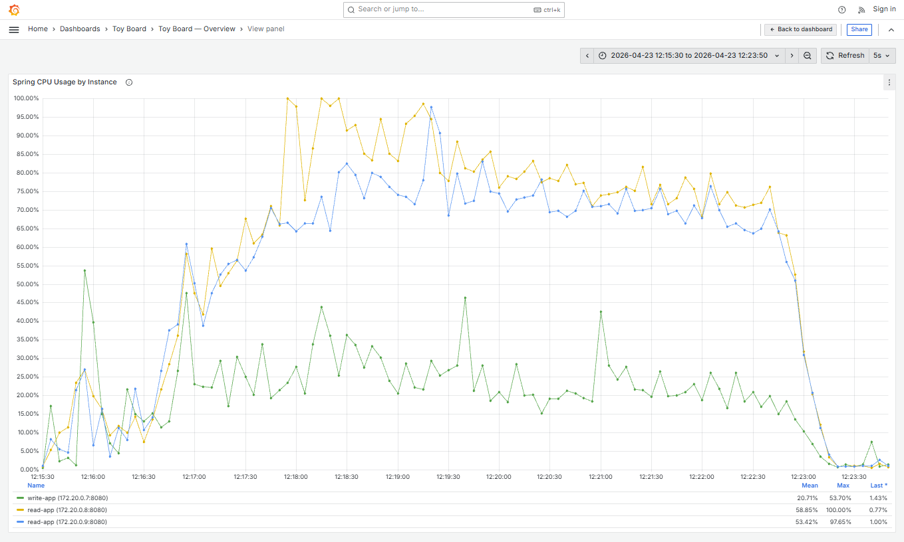
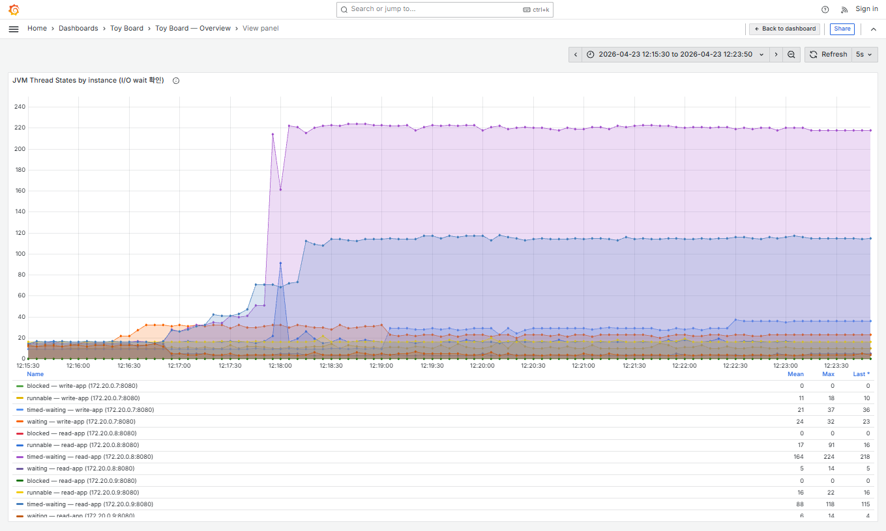
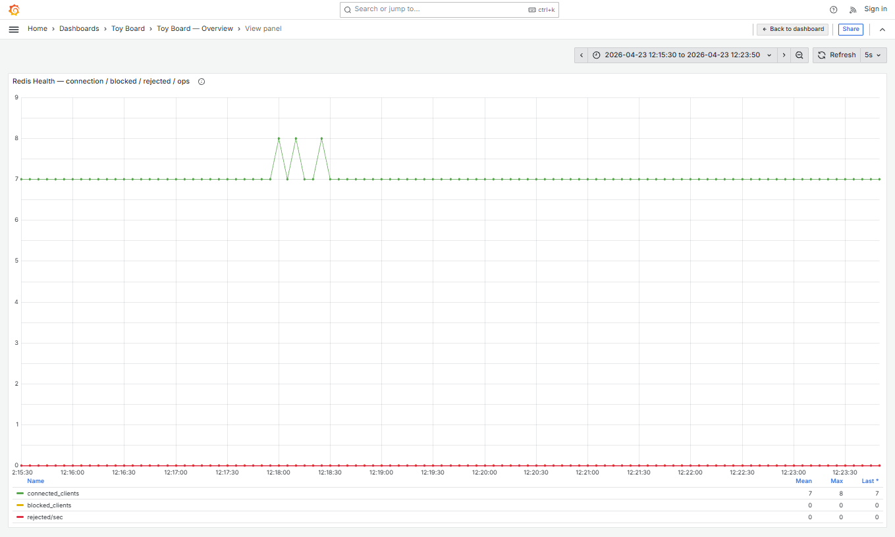
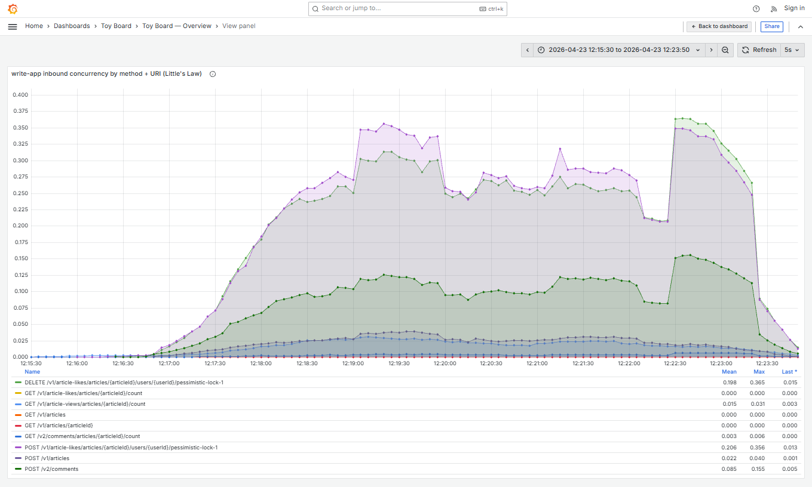
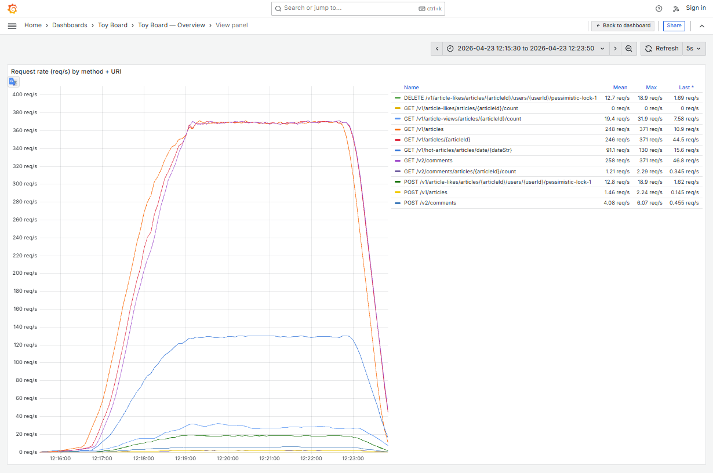
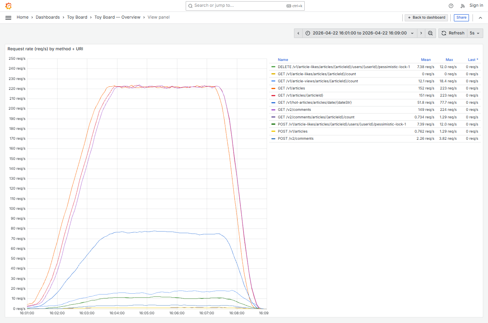
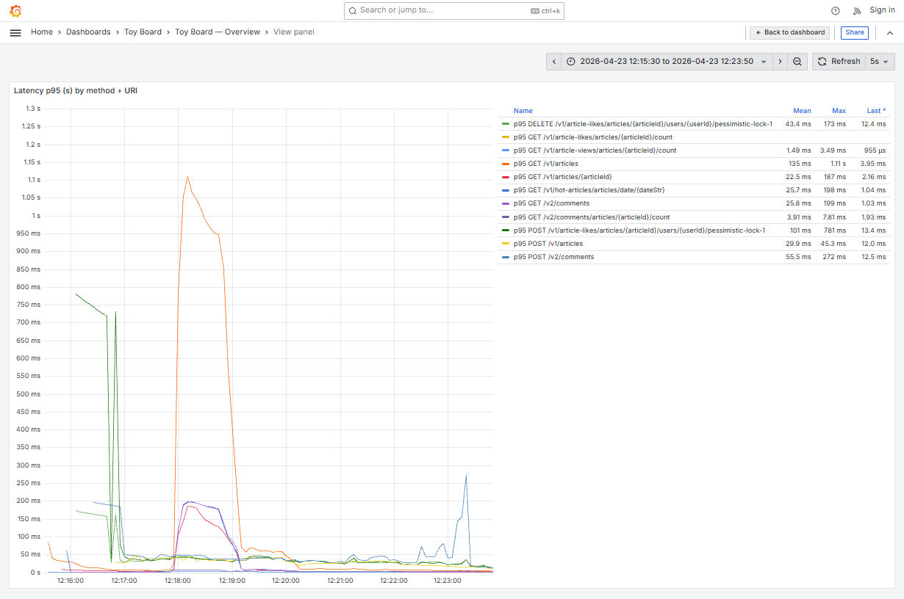
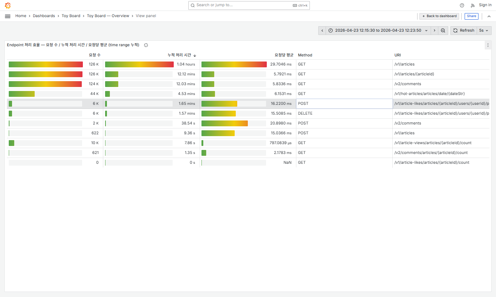
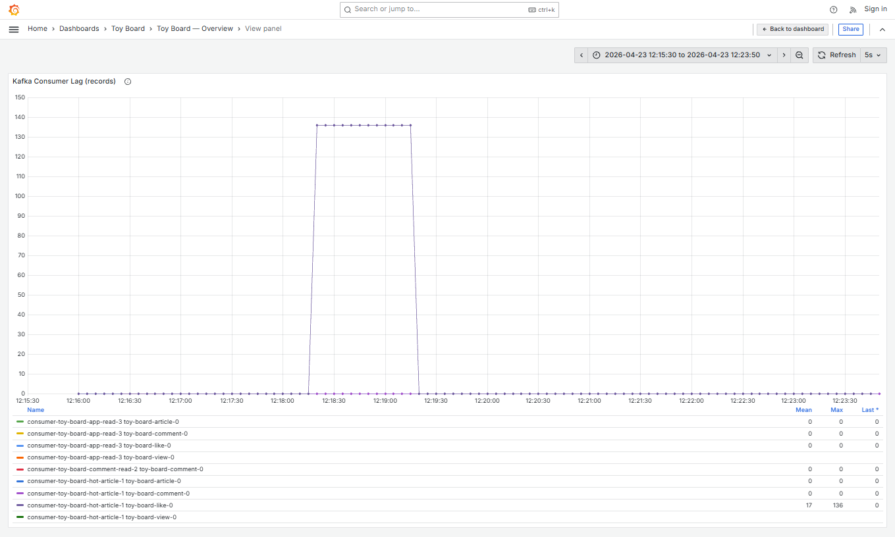

# stage12 — 관찰 노트

## 한 줄 요약

read-app CPU + Tomcat thread pool 200 포화되었으며, 병목은 **read-app 내부 자원**으로 분석됨.

## 한계 지표

| 항목 | stage12 | stage10 |
|---|---|---|
| 한계 RPS (p95<500ms) | **≥961** | ≥549 |
| p50 / p95 / p99 mean | **1.30 / 56.8 / 194 ms** | 1.23 / 5.47 / 12.9 ms |
| p99 max | **1.49 s** | 21.3 ms |
| 실패율 (http_req_failed) | **2.53%** | 0.00% |
| iterations | 126,621 | 69,854 |
| k6 thresholds | ❌ `http_req_failed`(>2%) + `http_req_duration p(99)<1500` 위반 | ✅ |

## 리소스 사용 (Grafana Legend)

| 지표 | stage12 mean / max | stage10 mean / max |
|---|---|---|
| CPU write-app | 20.71% / 53.70% | 11.88% / 35.40% |
| CPU read-app-1 (172.20.0.8) | **58.85% / 100.00%** | 29.66% / 72.00% |
| CPU read-app-2 (172.20.0.9) | **53.42% / 97.65%** | 25.32% / 54.40% |
| Kafka consumer lag | 0 / 0 (전 구간) | 0 / 0 |

## 분석 내용

### 1. read-app CPU 포화

- read-app-1 mean **58.85% / max 100.00%**, read-app-2 max 97.65%. write-app 은 여전히 mean 20% 수준으로 여유있음.

### 2. Tomcat thread pool 포화

- read-app-1 busy thread가 **max 값에 도달** 이후 요청들이 대기 큐로 쌓였으며 p99의 spike 시점과 일치함을 확인.

### 3. JVM thread 대기 폭증

- timed-waiting: read-app-1 mean **164 / max 224**. 
- 외부 I/O 대기로 보이나, 아래 4·5 근거상 Redis / HTTP 전부 유휴 상태이다.
- 즉, 대부분이 **Tomcat worker 의 task queue poll 대기** (고아 상태의 worker pool).

### 4. Redis 완전 유휴

- Redis / Lettuce 쪽은 어떤 포화 신호도 없었음.

### 5. read-app → write-app HTTP 호출도 미미

- POST/DELETE `/v1/article-likes/.../pessimistic-lock-1` 만 평균 0.2 수준
- read-app 이 호출하는 `GET /v1/article-views/.../count` 등은 평균 **0.015** — HTTP client pool 포화 가능성은 없는 것으로 확인된다.

### 6. 게시글 목록 조회 기능의 처리량 한계

#### [Req/s - stage12]

#### [Req/s - stage10]

#### [latency 95 - stage12]

#### [엔드포인트별 트래픽]

- 2번에서 Tomcat의 busy 스레드가 포화되는 시점은 2026-04-23 12:17:50 ~ 2026-04-23 12:17:55 사이이다. 이 시점 이후로 게시글 목록 조회 기능의 latency도 폭증하는 것을 확인할 수 있다.
- 이 때의 GET /v1/articles 엔드포인트의 처리량은 235 ~ 250 Req/s 이다. stage10에서의 처리량 최대값은 222 Req/s 였다. 
- VU를 12000으로 올리면서 다른 요청의 처리량도 함께 증가했겠지만 대략 이정도 수치가 현재 사양에서 감당할 수 있는 처리량 한계로 판단된다.

### 7. Kafka 인기글 컨슈머의 소비에도 영향

- 게시글 목록 조회 기능에 부하가 발생하여 동일한 서비스에 존재하던 Kafka 인기글 컨슈머 기능에도 부하가 전파되어 지연되는 현상을 포착할 수 있었다.
- 

## 다음 실험 계획

read 서비스 내에서 주 트래픽인 게시글 조회 도메인만 별도 서비스로 분리하되, 스케일 아웃은 추가로 하지않고 측정해보기로 결정

---

체크리스트 (RUN.md §7-10):
- [x] env.md / k6-summary.json / k6-console.txt
- [x] grafana-{overview, latency, cpu, timeshare, endpoint, kafka-lag}.png (기본 6장)
- [x] grafana-{tomcat-thread, jvm-thread, redis-health, write-app-concurrency, prometheus-scrape}.png (재측정 신규 5장)
- [x] ../README.md 요약 표 갱신 (이 커밋에 포함)
