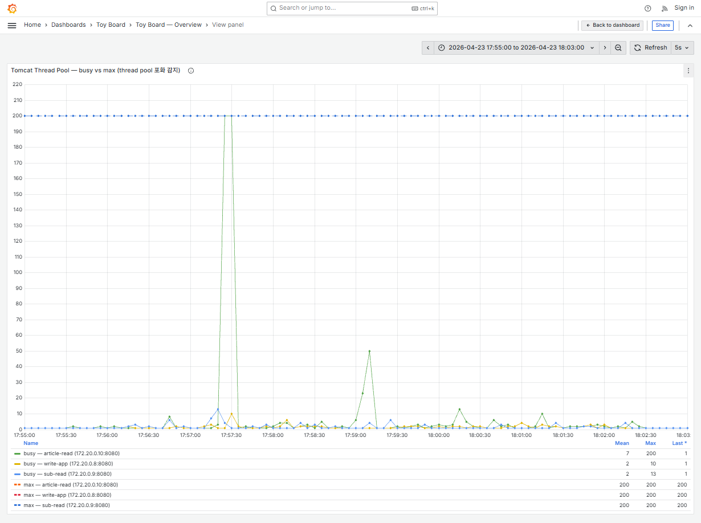
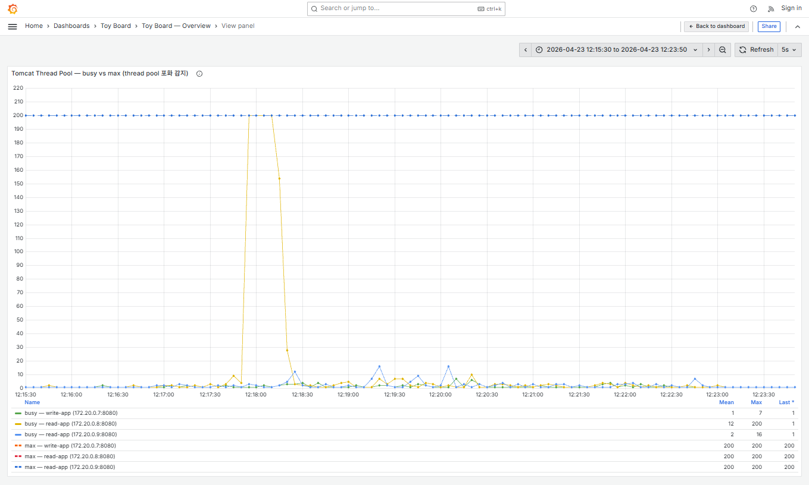
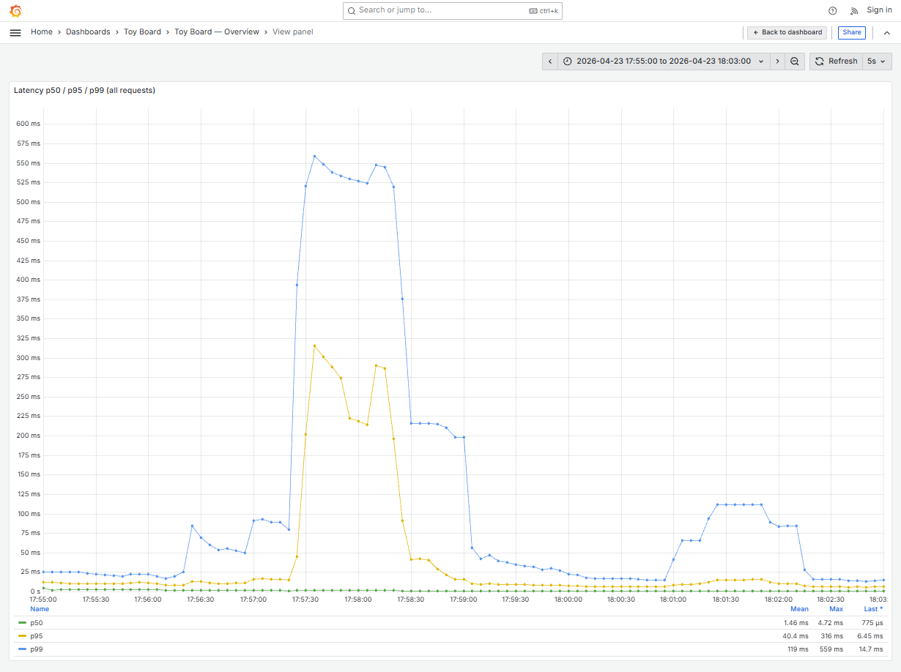
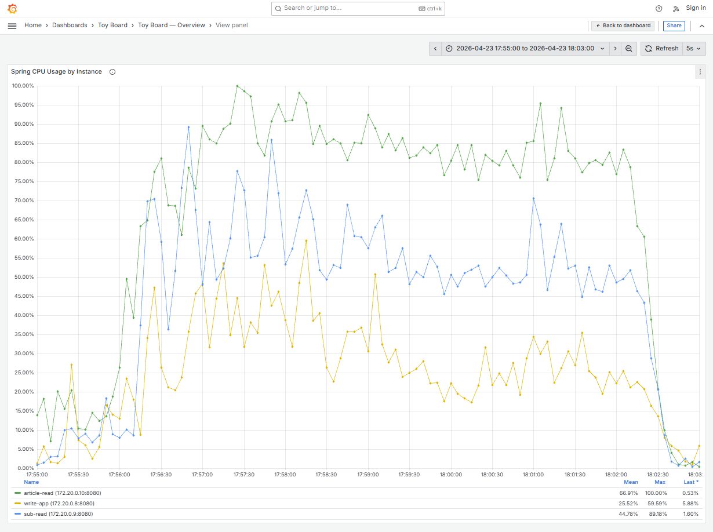
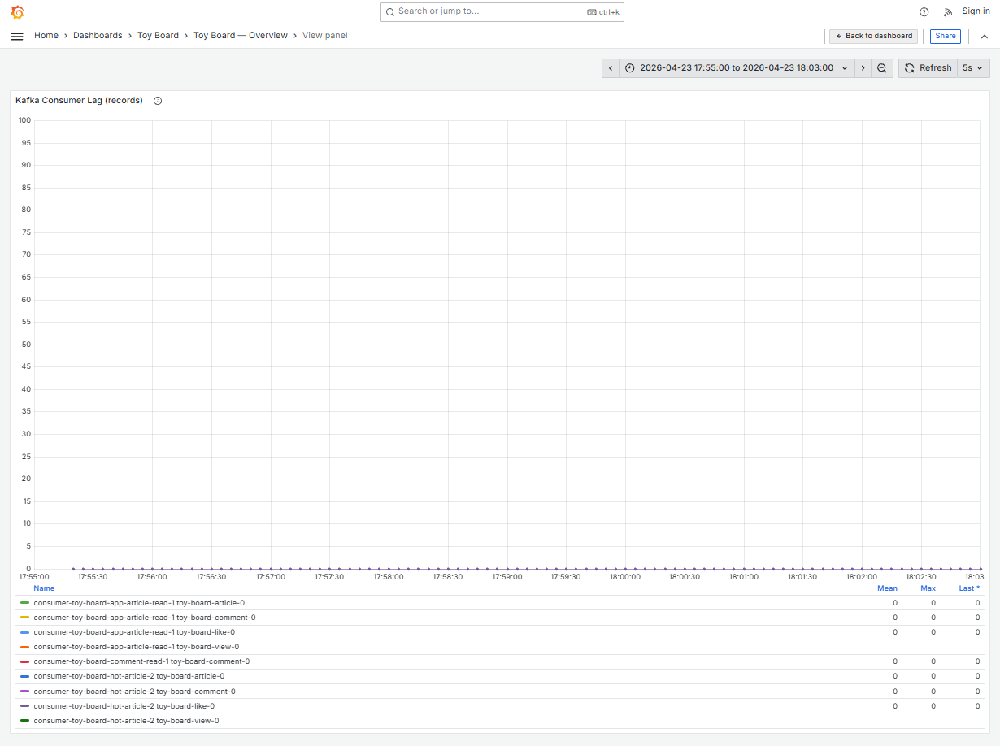
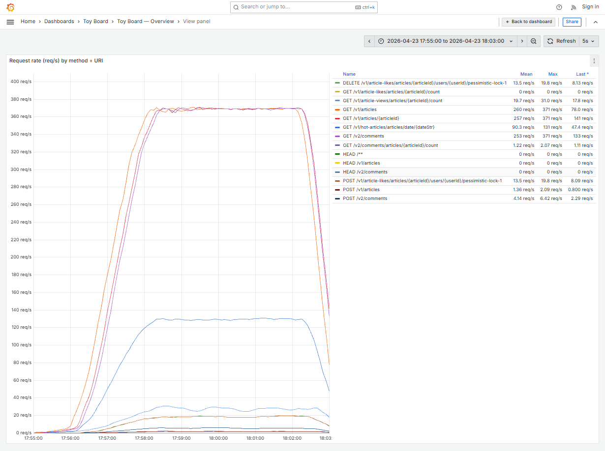
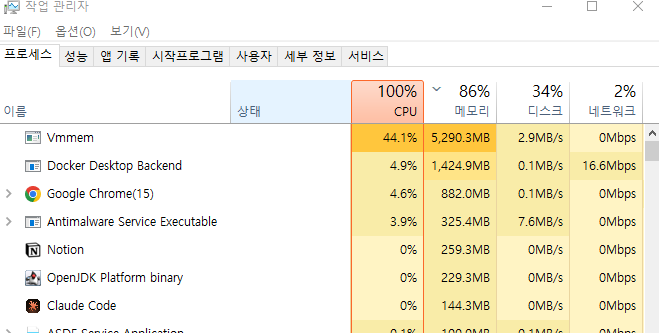

# stage13 — 관찰 노트

## 세 줄 요약

- read 서비스의 도메인 분리 결과, **Tomcat busy thread 지속 포화 상태가 단발성으로 완화**되고 p99 latency 가 모든 구간에서 개선되었다. 
- 하지만 **article-read 서비스의 CPU는 최대 100%** 까지 달성해 여전히 한계 상태.
- sub-read 서비스와 / write 서비스는 자원이 여유로운 상태로 확인.

## 한계 지표

| 항목 | stage13 | stage12 |
|---|---|---|
| p50 / p95 / p99 mean | **1.46 / 40.4 / 119 ms** | 1.30 / 56.8 / 194 ms |
| p99 max | **559 ms** | 1.49 s |
| GET /v1/articles 처리량 (mean / max) | **260 / 371 req/s** | 235 ~ 250 (max) |
| 엔드포인트 전체 합산 처리량 (mean 기준) | **≈909 req/s** | ≥961 |
| k6 thresholds | (k6-summary 미수집) | ❌ `http_req_failed`(>2%) + `p(99)<1500` 위반 |

## 리소스 사용 (Grafana Legend)

| 지표 | stage13 mean / max | stage12 mean / max |
|---|---|---|
| CPU write-app | 25.52% / 59.59% | 20.71% / 53.70% |
| CPU article-read | **66.91% / 100.00%** | (read-app-1) 58.85% / 100.00% |
| CPU sub-read | **44.78% / 89.18%** | (read-app-2) 53.42% / 97.65% |
| Tomcat busy — article-read | mean 7 / **max 200 (단발)** | (read-app-1) 지속 포화 |
| Tomcat busy — sub-read | mean 2 / max 13 | — |
| Tomcat busy — write-app | mean 2 / max 10 | — |
| Kafka consumer lag | **0 / 0 (전 구간)** | 0 / 0 (단 hot-article consumer 일시 지연 관찰) |

## 분석 내용

### 1. Tomcat thread pool 포화의 분포가 좁아져 다소 완화됨

#### [Tomcat threads - stage13]  

#### [Tomcat threads - stage12]

- article-read busy thread 가 **17:57:30 전후 1회 200 도달** 후 즉시 해소 (mean 7). stage12 에서 hold 구간 내내 200 에 붙어있던 것과 대비된다.
- sub-read 는 max 13 수준으로 완전 여유롭다. `/v1/hot-articles/*` 와 `/v2/comments*` 트래픽이 article-read 와 분리되어 한쪽 서비스의 스레드 풀을 잡아먹지 않고있음.

### 2. Latency 개선

- p99 mean 194 → **119 ms (-39%)**, p99 max 1.49s → **559 ms (-62%)**.
- peak 도 1회 burst (17:57:30) 에 국한되고 hold 구간 내내 유지되지 않음.

### 3. CPU 분배 — article-read 여전히 한계 상태

- article-read mean **66.91% / max 100%**. 여전히 주 트래픽 (`GET /v1/articles*`) 이 한 컨테이너 1.0 CPU 에 몰려 포화.
- sub-read mean 44.78%, write-app mean 25.52% — 두 컨테이너 모두 여유. 즉 이 상태에서 추가 개선 방향은 **article-read 내부 최적화** 또는 **CPU 재분배 (article-read 에 1.5 / sub-read 와 write 에 0.75 씩)** 가 자연스러움.

### 4. Kafka consumer 영향 격리

- stage12 에서 `read-app` 내부에 있던 hot-article consumer 가 게시글 목록 조회 부하의 영향을 받아 일시 지연(mean 17, max 136)됐던 현상이 **이번에는 관찰되지 않음** — 도메인 분리로 CPU 경쟁이 해소되었음!

### 5. 엔드포인트별 처리량

- 게시글 읽기 서비스로 분리하여, 이제 기능에 대한 처리량 한계를 보다 명확히 파악할 수 있게되었다.
- article-read 서비스의 tomcat이 포화된 시점인 2026-04-23 17:57:20 ~ 2026-04-23 17:57:25 사이의 `GET /v1/articles` 처리량은 253 ~ 257 Req/s로 이 수치가 현 스펙에서 이 기능의 처리량 한계임을 알 수 있다. 

### 6. 변수 : 시스템 전체 CPU 포화

부하 테스트 도중 위처럼 시스템 전체 CPU가 포화 상태에 여러번 도달하고 있었다. 이러면 Docker로 올린 각 Spring 애플리케이션에 CPU 자원 분배가 제대로 이루어지지 않았을 수 있음!

## 다음 실험 계획

- 시스템 전체 CPU 포화 변수로 시스템 환경을 여유있게 변경하여 재테스트할 필요성을 느꼈다.
- 따라서 k6 부하를 현재 이 데스크탑에서 실행하고, 가지고 있는 Mac OS를 서버자원으로 구성하여 재테스트 예정!

---

체크리스트 (RUN.md §7-10):
- [x] env.md / grafana-*.png (11장)
- [ ] k6-summary.json / k6-console.txt (미수집 — iteration / 실패율 추후 갱신)
- [x] ../README.md 요약 표 갱신
