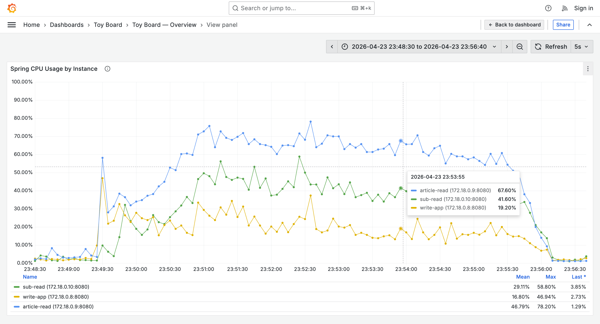
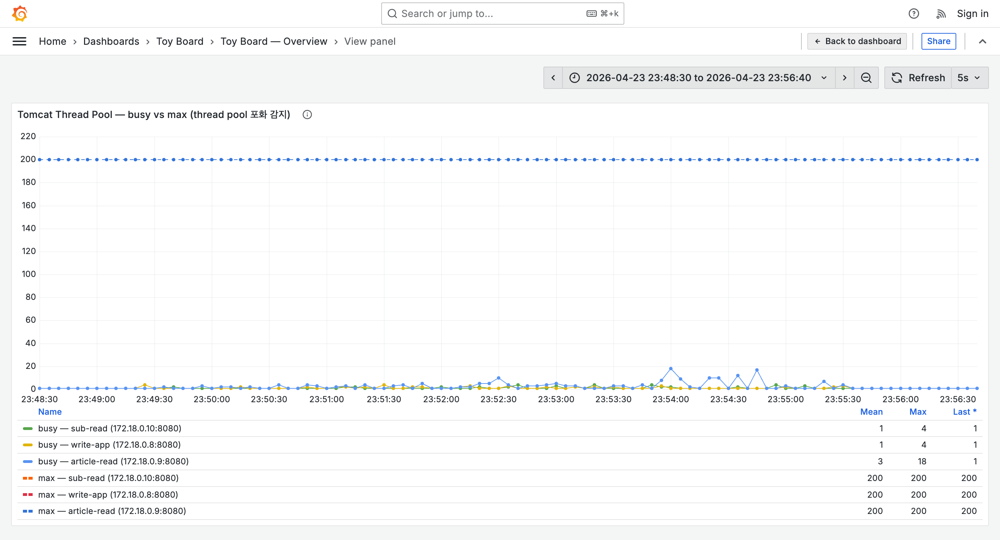
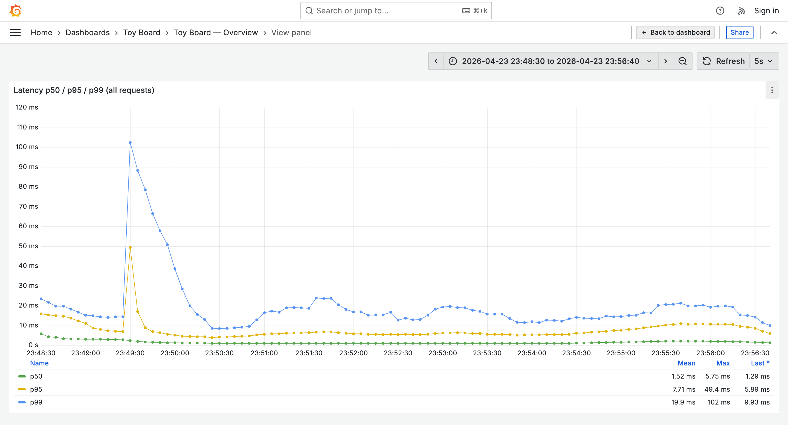

# stage14 — 관찰 노트

## 세 줄 요약

- 서버 호스트를 macOS 로 옮긴 결과, **서버 측 자원 전 구간 여유**롭게 바뀌고 포화가 사라졌다.
- 주 병목이던 Tomcat 스레드 포화현상도 말끔히 사라졌다.
- 그런데 k6 클라이언트 실패율 **2.93%**이 존재한다.

## 한계 지표

| 항목 | stage14 | stage13 |
|---|---|---|
| 서버 p50 / p95 / p99 mean | **1.52 / 7.71 / 19.9 ms** | 1.46 / 40.4 / 119 ms |
| 서버 p99 max | **102 ms** | 559 ms |
| 클라이언트 http_req_duration p(95) | **81.1 ms** | (k6-summary 미수집) |
| 클라이언트 http_req_duration max | **631 ms** | — |
| 클라이언트 http_req_connecting max | **15,048 ms** | — |
| GET /v1/articles 처리량 | (Grafana) mean ≈ 314K/range → ≈ 650~700 req/s 추정 | mean 260 / max 371 req/s |
| 전체 http_reqs rate | **952 req/s** (k6 기준) | — |
| 완료 iterations | **130,453** (+ 7,974 interrupted) | — |
| board_writes | **14,256** (30.99/s) | — |
| k6 thresholds | ❌ `http_req_failed` 2.93% (>2%), `p(95)<500` ✓, `p(99)<1500` ✓ | ❌ 실패율 + p99 위반 |

## 리소스 사용 (Grafana Legend)

| 지표 | stage14 mean / max | stage13 mean / max |
|---|---|---|
| CPU write-app | **16.80% / 46.94%** | 25.52% / 59.59% |
| CPU article-read | **46.79% / 78.20%** | 66.91% / 100.00% |
| CPU sub-read | **29.11% / 58.80%** | 44.78% / 89.18% |
| Tomcat busy — article-read | **mean 3 / max 18** | mean 7 / max 200 (단발) |
| Tomcat busy — sub-read | **mean 1 / max 4** | mean 2 / max 13 |
| Tomcat busy — write-app | **mean 1 / max 4** | mean 2 / max 10 |
| Kafka consumer lag | **0 / 0 (전 구간)** | 0 / 0 |

## k6 체크 통과율

| Group | 성공률 | 비고 |
|---|---|---|
| list articles (`GET /v1/articles`) | **92.8%** (127,961 / 137,805) | 실패 9,844 건 |
| hot articles (`GET /v1/hot-articles`) | **93.8%** (44,515 / 47,472) | 실패 2,957 건 |
| create article (`POST /v1/articles`) | **93.7%** (621 / 663) | 실패 42 건 |
| read article (`GET /v1/articles/{id}`) | **100%** (120,196) | — |
| list comments (`GET /v2/comments`) | **100%** (118,233) | — |
| toggle like (POST/DELETE `/v1/article-likes/...`) | **100%** (5,898 / 5,893) | — |
| create comment (`POST /v2/comments`) | **99.9%** (1,800 / 1,802) | — |

실패가 **iteration 초기 단계 (list / hot / create article)** 에 집중. read/comments/like 는 전혀 실패 없음 → VU 가 iteration 을 새로 시작하며 TCP 연결을 여는 지점에서 문제 발생.

## 분석 내용

### 1. 서버 자원 — 전 구간 여유롭게 변경되었음



- stage13 에서 max 100% 까지 밀어붙였던 상태와 비교 불가능할 만큼 여유가 생겼다.
- stage13 의 "호스트 전체 CPU 포화" 로 인해 Docker 컨테이너가 CPU 를 할당받지 못해 Spring 쪽 처리량에 큰 악영향을 주었던 것으로 판단됨.

### 2. Tomcat thread pool — 포화 없음



- 세 서비스 모두 busy max ≤ 18.
- stage13 에서 단발적으로 포화 현상이 있었던 article-read 도 이번에는 전혀 그 영역에 닿지 않았다.
- Thread pool은 VU 12000 / 952 req/s 수준에서 병목이 전혀 아니었음

### 3. 서버 latency — 대폭 개선



- p99 **mean 19.9ms / max 102ms**. 
- stage13 (mean 119ms / max 559ms) 대비 p99 mean **−83%**, max **−82%**.
- 초반 23:49:30 전후 단발 peak (p99 102ms, p95 49.4ms) 외에는 hold 구간 내내 p99 < 25ms 로 안정.

### 4. 네트워크 계층에서의 요청 유실

CPU가 여유있음에도 K6 실험결과 HTTP 요청실패가 12,845건이나 발생했다. 원인을 파악하기 위해 먼저 nginx 로그를 확인해봤다.

```
docker logs --since '2026-04-23T14:48:00Z' --until '2026-04-23T14:57:00Z' toy-board-nginx 2>/dev/null | grep -v 'nginx-health' | wc -l
```

| 항목 | 값                                           |
  |---|---------------------------------------------|
| k6 가 보낸 요청 (`http_reqs`) | 437,962                                     |
| nginx 가 받은 요청 (헬스체크 제외) | 425,153                                     |
| **유실 건수** | **12,809**                                  |
| k6 실패 기록 (`http_req_failed`) | 12,845                                      |
 | http_req_connecting max | 15,048ms
| 오차 | 36건 (0.28%, nginx 로그 집계 시간 오차 수준으로 이해 가능할듯) |

<br/>

#### nginx 컨테이너의 /proc/net/netstat

| 카운터 | 값 |
|---|---|
| ListenOverflows | 0 |
| ListenDrops | 0 |
| TCPBacklogDrop | 0 |
| TCPReqQFullDrop | 0 |
| TCPFastOpenListenOverflow | 0 |

- nginx까지 잘 도달한 요청은 처리가 잘되었지만, 도달조차 되지 못하고 유실된 요청들이 존재했다고 해석이 가능할 것 같다.
- Window에서 K6 부하를 실행할 때 CPU가 100%를 여러번 찍은 순간이 있는데, 아마 이게 주요인일 것으로 보인다.

## 다음 실험 계획

- Window에서 K6를 Docker를 벗겨내고 재테스트 후 실패 발생하는지 확인

---

체크리스트 (RUN.md §7-10):
- [x] env.md / grafana-*.png (13장)
- [x] k6-summary.json / k6-console.txt (수집 완료)
- [x] ../README.md 요약 표 갱신
